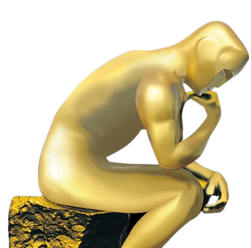

# Do the Academy Awards Reflect Audience Taste? Oscar's winners vs user's ratings

Are you sad that your favorite movie did not win an Oscar? 

    

        “But it had a very high rating among users, why did this other random movie win?”
        

    

    

Look no further! ADA can help us investigate. 

## But what are the Oscars?
It's not your favorite uncle Oscar!

The Oscars are a common name for the Academy Awards. Those award artisic and technical merits in the film industry. 

Fun fact: The origin of the name is disputed but the most famous story is the one of an Academy Awards librarian called Margaret Herrick. When seeing the golden statuette, she exclamed that it reminder her of her Uncle Oscar! 

So it might actually be your favorite uncle Oscar...

### Who votes?
They are voted by the Academy's Voting Membership. This membership is divided into different branches. Each branch represents a different discipline in film production.

Every year, several movies are nominated by the voters in each branch. Thus actors nominate for actors, directors for directors and so on. But in the end, only one movie wins the golden statuette in each category. However, the Best Picture category is the most general one, as every member nominates their favorite movies.

All active members in the Academy can vote for all of the categories. They must rank the nominated movies in their preferential order. The movie that gets 50 percent or more of the votes is the winner.

In this story, we will see if there is a big difference between the people's ratings and Oscar awards. We will also see if there is a recipe to success among the Academy Awards.

## The data we have
The data we are working on comes from several datasets:

- The CMU dataset
- The IMDB dataset
- Oscar winners and nominees for each year

* * *

## Do Oscar-winning films generally have higher ratings compared to non-winning nominees and top box-office hits?

  

* * *

## Are there discernible biases within Oscar winners, such as genre, nationality, or star power, that differ from audience preferences? (Q6)

However as we have seen in the introduction, the nomination and voting is done by the same members. Thus the critic's bias may already be in the nomination. We will now compare the nominated movies with movies that were not.

 

We know that the Academy Awards are USA-centric. 

### What does it take to be nominated as best picture?

* * *

## Is there a correlation between high-profile actors/directors and Oscar wins, regardless of ratings? 

    

        "OMG Steven Spielberg directed this movie, it must be a nice one!"
        

    

    

Do you really need to make a great movie if Leonardo Di Caprio plays in it? Or if Quentin Tarantino directed it? Let's see if the jury is biased towards some members!

  

* * *

## Does winning an Oscar lead to a measurable increase in ratings or review counts (i.e., the "Oscar bump")? 

    

        "I'm sure that people only like a movie because it won an Oscar!"
        

    

    

Well my friend, let's see.

  

<h2> How do ratings of Oscar-winning films evolve over time? </h2>

Does a winner movie age well, like your favourite wine, with the audience?

We will see how the sentiment of the reviews evolves over the time after the Oscar ceremony. Is there a noticeable "hype effect" surrounding the awards?

  

<h2> Conclusion </h2>

